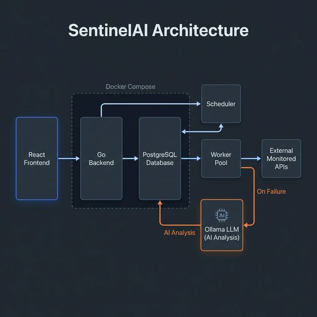

# SentinelAI

SentinelAI is a production-grade API Monitoring SaaS that watches over your application infrastructure. It actively tracks target vital signs and utilizes local Large Language Models to automatically diagnose and explain HTTP routing and server failures.

## Tech Stack

- **Frontend**: React, Vite, TypeScript, Tailwind CSS
- **Backend**: Go (Golang), Gin Framework
- **Database**: PostgreSQL 15
- **AI Engine**: Ollama (Local LLM)
- **Infrastructure**: Docker & Docker Compose

## Architecture



This project strictly follows Clean Architecture principles to separate concerns efficiently. The modern Vite React frontend orchestrates traffic via a decoupled Go backend. Background Goroutines dynamically distribute health checks properly governed by a central Scheduler. When anomalies arise, isolated Ollama AI processes diagnose the precise failure, persisting synthesized explanations into a PostgreSQL registry orchestrated within Docker Compose.

## Features

- Interval-based uptime monitoring for APIs and websites
- Intelligent AI-powered root-cause analysis on failures
- Concurrent backend worker pool mapping
- PostgreSQL persistent storage abstractions
- Secure JWT-based Authentication
- Polished, responsive UI dashboard

## Setup Instructions

### Backend (Docker)
Ensure Docker is running locally, then spin up the Go backend and PostgreSQL database:
```sh
docker compose up --build
```

### Frontend (Dev)
In a separate terminal, install dependencies and run the Vite frontend development server:
```sh
cd frontend
npm install
npm run dev
```

## System Design

### Worker Pool Design
The monitoring engine distributes operations via a fixed-size worker pool utilizing Go channels. Configurable goroutine workers are spawned on application startup to ingest HTTP health check jobs dynamically from a buffered channel, enforcing strict concurrency safety and isolating request latencies.

### LLM Failure Analysis
When the worker pool encounters a connection timeout or registers a failing HTTP boundary (e.g., Status >= 400), it safely isolates the execution context and queries a local Ollama LLM provider. The model generates a concise diagnostic explanation based strictly on the failed headers and status codes, which is persisted directly into the monitor log.

### DTO Response Mapping
The Go handler implementations enforce strict Data Transfer Object (DTO) abstractions. Domain entity structures like pure `time.Duration` nanoseconds are correctly and safely parsed into frontend-compatible millisecond integers (`int64`) specifically at the response array payload boundary, preventing data bleeding across architectural zones.
